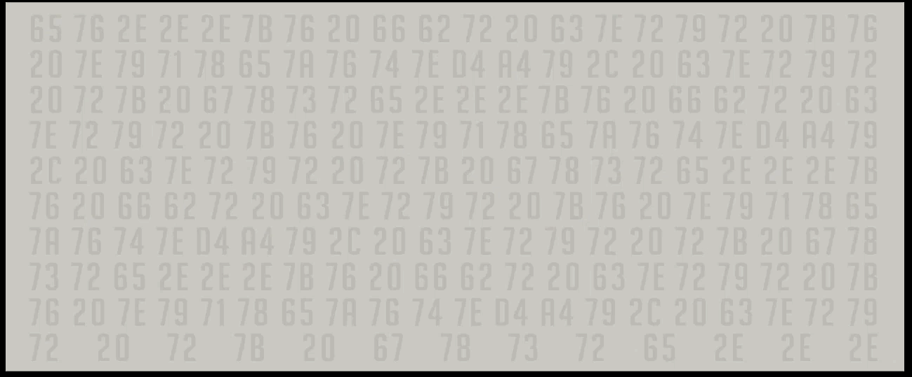
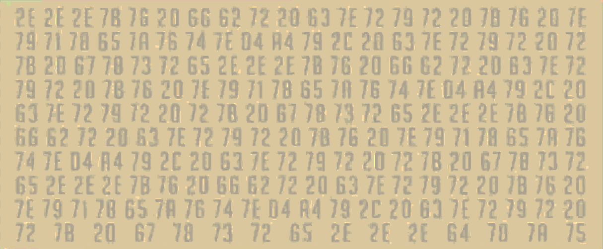

Ana Origin Story
================

On July 12, 2016, a video for the new Overwatch hero named Ana was released.

https://www.youtube.com/watch?v=TE0CXgpNxG0

Hex Screenshots
---------------

Hex values can be seen in the video at 2 specific time stamps

### 1:16

### 2:11

### Hex Text Files

Hex values were extracted 1:16 and 2:11 in the video and are included
in this directory as text files.

    $ cat hex-1\:16.txt
    2E 2E 2E 7B 76 20 66 62 72 20 63 7E 72 79 72 20 7B 76 20 7E
    79 71 78 65 7A 76 74 7E D4 A4 79 2C 20 63 7E 72 79 72 20 72
    7B 20 67 78 73 72 65 2E 2E 2E 7B 76 20 66 62 72 20 63 7E 72
    79 72 20 7B 76 20 7E 79 71 78 65 7A 76 74 7E D4 A4 79 2C 20
    63 7E 72 79 72 20 72 7B 20 67 78 73 72 65 2E 2E 2E 7B 76 20
    66 62 72 20 63 7E 72 79 72 20 7B 76 20 7E 79 71 78 65 7A 76
    74 7E D4 A4 79 2C 20 63 7E 72 79 72 20 72 7B 20 67 78 73 72
    65 2E 2E 2E 7B 76 20 66 62 72 20 63 7E 72 79 72 20 7B 76 20
    7E 79 71 78 65 7A 76 74 7E D4 A4 79 2C 20 63 7E 72 79 72 20
    72 7B 20 67 78 73 72 65 2E 2E 2E 64 78 7A 75

and

    $ cat hex-2\:11.txt
    65 76 2E 2E 2E 7B 76 20 66 62 72 20 63 7E 72 79 72 20 7B 76
    20 7E 79 71 78 65 7A 76 74 7E D4 A4 79 2C 20 63 7E 72 79 72
    20 72 7B 20 67 78 73 72 65 2E 2E 2E 7B 76 20 66 62 72 20 63
    7E 72 79 72 20 7B 76 20 7E 79 71 78 65 7A 76 74 7E D4 A4 79
    2C 20 63 7E 72 79 72 20 72 7B 20 67 78 73 72 65 2E 2E 2E 7B
    76 20 66 62 72 20 63 7E 72 79 72 20 7B 76 20 7E 79 71 78 65
    7A 76 74 7E D4 A4 79 2C 20 63 7E 72 79 72 20 72 7B 20 67 78
    73 72 65 2E 2E 2E 7B 76 20 66 62 72 20 63 7E 72 79 72 20 7B
    76 20 7E 79 71 78 65 7A 76 74 7E D4 A4 79 2C 20 63 7E 72 79
    72 20 72 7B 20 67 78 73 72 65 2E 2E 2E

### Hex xor and utf-8 conversion

To crack this we have to convert each character to ascii first, and
xor the hex value with 23 (Sombra being the 23rd hero to be released)
if the character is NOT a `"."` or `" "`.  Then, take the new xor'd value
and convert the entire collection of numbers to utf-8.

The first frame

    $ cat hex-1\:16.txt | ./hex-xor-cipher 23
    ...la que tiene la información; tiene el poder...la que tiene la información; tiene el poder...la que tiene la información; tiene el poder...la que tiene la información; tiene el poder...somb

The second frame

    $ cat hex-2\:11.txt | ./hex-xor-cipher 23
    ra...la que tiene la información; tiene el poder...la que tiene la información; tiene el poder...la que tiene la información; tiene el poder...la que tiene la información; tiene el poder...

Both together

    $ cat hex-1\:16.txt hex-2\:11.txt | ./hex-xor-cipher 23
    ...la que tiene la información; tiene el poder...la que tiene la información; tiene el poder...la que tiene la información; tiene el poder...la que tiene la información; tiene el poder...sombra...la que tiene la información; tiene el poder...la que tiene la información; tiene el poder...la que tiene la información; tiene el poder...la que tiene la información; tiene el poder...

Notice the following

1. no line breaks
2. `"."` and `" "` had to be skipped in the cipher
3. first message ends with `"...somb"` and the second begins with `"ra..."`

Results
-------

We have the translated phrase "She who has the information, has the power..."
repeated a number of times, as well as the term `sombra` (uncapitalized).

Massaging the data by injecting a newline after every occurrence of `"..."` yields
something slightly easier to see:

    $ cat hex-1\:16.txt hex-2\:11.txt | ./hex-xor-cipher 23 | sed -e 's/\.\.\./...\n/g'
    ...
    la que tiene la información; tiene el poder...
    la que tiene la información; tiene el poder...
    la que tiene la información; tiene el poder...
    la que tiene la información; tiene el poder...
    sombra...
    la que tiene la información; tiene el poder...
    la que tiene la información; tiene el poder...
    la que tiene la información; tiene el poder...
    la que tiene la información; tiene el poder...

References
----------

- http://wiki.gamedetectives.net/index.php?title=Sombra_ARG#Ana_Origin_Video
