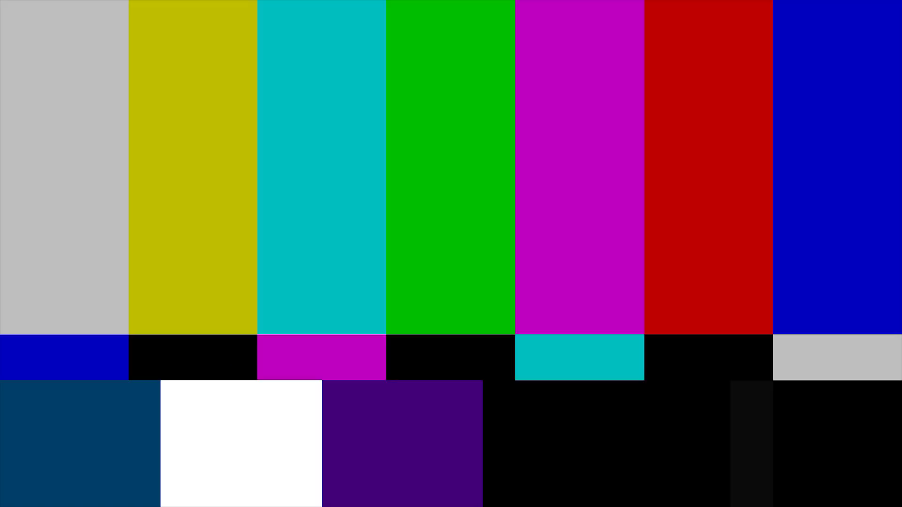
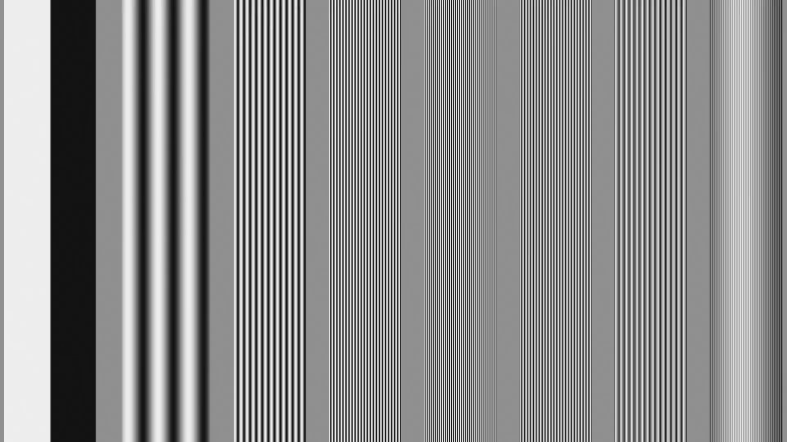
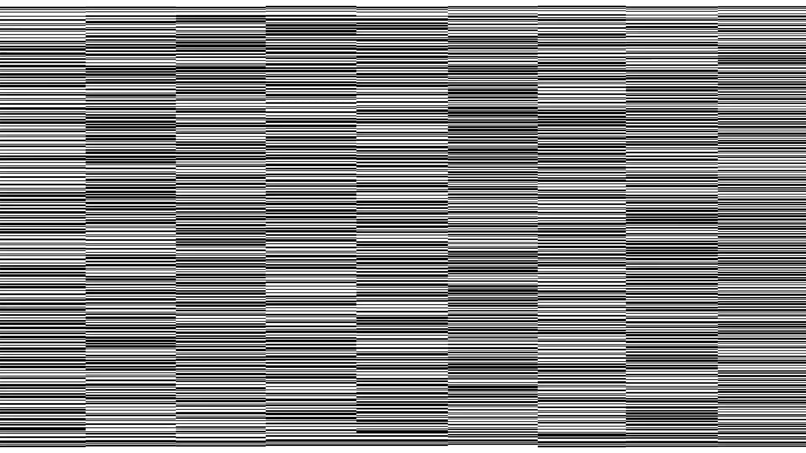

Dev Update Video
================

On July 19, 2016, a developer update video for the new Overwatch hero named Ana
was released.

https://www.youtube.com/watch?v=evghkilg2eQ

Frame Screenshots
-----------------

At the very end of the video, there flash 4 distinct frames that
look meaningless at first, in order of appearance:

### Frame 1

### Frame 1

### Frame 3

### Frame 4

These frames were extract from the video by downloading the original 1080p
video from youtube, and then running the following command to extract all frames
at the end of the video.

    ffmpeg -ss 00:12:21.000 -i ana-video.mp4 -r 30/1 ana-frame-%03d.png

I then manually pulled out the 4 distinct frames from the resulting images

### Barcodes in Frame 3

In frame 3 there are 9 distinct barcodes running vertically through the image.
We know the frame is 1080p resolution, so the width must be 1920px, but we can
verify this with:

    $ identify assets/ana-frame-3.png
    assets/ana-frame-3.png PNG 1920x1080 1920x1080+0+0 8-bit sRGB 146KB 0.000u 0:00.000

The image can be chopped into 9 distinct parts knowing this information (already done,
see the [assets/](assets) directory).

    $ echo '1920 / 9' | bc
    213

Each barcode *should* be 213 pixels wide, however upon closer inspection, it
appears some are slightly longer than others.  To compensate, 100px wide shots
were extracted every 220 pixels.

    for i in {0..8}; do convert -crop "100x1080+$((220*i))x0" ana-frame-3.png "ana-barcode-$i.png"; done

### Reading the Barcodes

To read these barcodes unfortunately I could not find a good command line utility, however this
website works really well as it allows you to pass in a URL.

http://www.onlinebarcodereader.com/

Using the raw GitHub URLs, this be done easily for the following 9 images

- [Barcode 0](https://raw.githubusercontent.com/bahamas10/sombra/dave-1471116722/01-dev-update-video/assets/ana-barcode-0.png)
- [Barcode 1](https://raw.githubusercontent.com/bahamas10/sombra/dave-1471116722/01-dev-update-video/assets/ana-barcode-1.png)
- [Barcode 2](https://raw.githubusercontent.com/bahamas10/sombra/dave-1471116722/01-dev-update-video/assets/ana-barcode-2.png)
- [Barcode 3](https://raw.githubusercontent.com/bahamas10/sombra/dave-1471116722/01-dev-update-video/assets/ana-barcode-3.png)
- [Barcode 4](https://raw.githubusercontent.com/bahamas10/sombra/dave-1471116722/01-dev-update-video/assets/ana-barcode-4.png)
- [Barcode 5](https://raw.githubusercontent.com/bahamas10/sombra/dave-1471116722/01-dev-update-video/assets/ana-barcode-5.png)
- [Barcode 6](https://raw.githubusercontent.com/bahamas10/sombra/dave-1471116722/01-dev-update-video/assets/ana-barcode-6.png)
- [Barcode 7](https://raw.githubusercontent.com/bahamas10/sombra/dave-1471116722/01-dev-update-video/assets/ana-barcode-7.png)
- [Barcode 8](https://raw.githubusercontent.com/bahamas10/sombra/dave-1471116722/01-dev-update-video/assets/ana-barcode-8.png)

### Barcodes to hex

Reading the 9 barcodes give us the following hex output (in order)

    $ cat hex.txt
    FEC-820-BA9-BAD-BAF-824-FEA-5-F28-980-5B0-F59
    4B1-2C7-F83-748-7F4-719-AAA-2C8-1F6-47C-5A8-DBA
    7F-1541-85D-E5D-35D-1C41-157F-500-49D-122-11D8-D9C
    279-919-4AA-800-1E9-308-3F1-EDC-CB3-602-DE9-8
    153-690-BF0-CA1-2B-D03-9C8-866-DF7-EF9-C21-20
    1FD7-1F79-1582-1252-806-1B4B-1FB7-1050-532-9A9-1870-1FEF
    3A0-A43-AFF-793-658-C-FE4-821-BA4-BA8-BAA-82F-FED
    B6A-BD4-496-324-A2F-3C3-78E-723-634-B9-287-EFA-172
    1B5E-17F9-83D-160-1BFE-1D14-956-318-5F1-6D7-1BC-C24-18CF

### Hex to Binary QR Code

The final step is to convert the hex to binary, rearrange it a bit, and make a
QR code out of it (where 0 is white and 1 is black).

    $ cat hex.txt | ./hex-to-qr
    1111111011000100101100010000001111111
    1000001000000010110001111010101000001
    1011101010011111100000110100001011101
    1011101011010111010010000111001011101
    1011101011110111111101000001101011101
    1000001001000111000110011110001000001
    1111111010101010101010101010101111111
    0000000001010010110010000010100000000
    1111001010000001111101100010010011101
    1001100000000100011111000000100100010
    0101101100000101101010001000111011000
    1111010110011101101110100110110011100
    0010011110010001010100111111111010111
    1001000110010110100100001111101111001
    0100101010101011111100001010110000010
    1000000000001100101000011001001010010
    0001111010010000001010110100000000110
    0011000010001101000000111101101001011
    0011111100011001110010001111110110111
    1110110111001000011001101000001010000
    1100101100111101111101110010100110010
    0110000000101110111110010100110101001
    1101111010011100001000011100001110000
    0000000010000000001000001111111101111
    0011101000001011011010101101101011110
    1010010000111011110101001011111111001
    1010111111110100100101100100000111101
    0111100100110011001001000000101100000
    0110010110001010001011111101111111110
    0000000011000011110000111110100010100
    1111111001000111100011100100101010110
    1000001000010111001000110001100011000
    1011101001000110001101000010111110001
    1011101010000000101110010011011010111
    1011101010100010100001110000110111100
    1000001011111110111110100110000100100
    1111111011010001011100101100011001111

You can run the command line tool manually to see the code, or put it in a
[Binary to QR Code converter](https://bahamas10.github.io/binary-to-qrcode/) (I
made it specifically for this ARG).

### Scan QR code

> ¿Estuvo eso facilito? Ahora que tengo su atención, déjenme se las pongo más difícil.

translated

> Was that easy? Well, now that I have your attention, allow me to make things much more difficult

Results
-------

Things are about to get really tough... we have our work cut out for us

References
----------

- http://wiki.gamedetectives.net/index.php?title=Sombra_ARG#Dev_Update_Video
- https://m.reddit.com/r/Overwatch/comments/4tn3vr/sombra_hint_in_new_dev_update/
- https://gist.github.com/zapu/31165efab0d6264e2fd0fa75cc53b1aa
- https://zapu.net/sombra.txt
