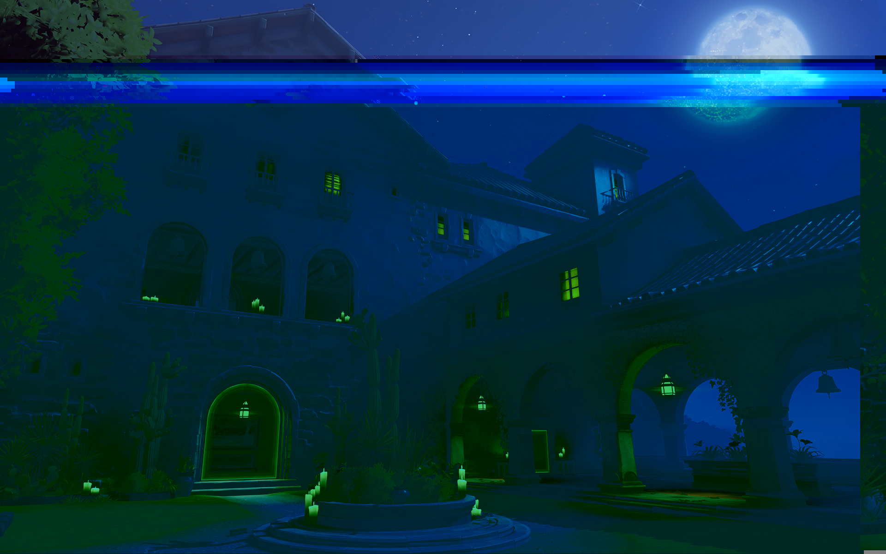

Dorado Screenshot
=================

On (DATE HERE), a new screenshot of Dorado was uploaded on the
[Play Overwatch](https://playoverwatch.com/en-us/media/) media page.

Glitched Dorado Picture
----------------------

It was discovered that the picture had appeared to have been "Data Moshed".  Basically, some bytes
were modified in the picture.  Comparing the modified bytes to those found in
the original (the byte-by-byte difference) revealed a message.

Using the `diff-mosh` tool in the [tools](../tools) directory of this repository, we can easily spot
the message.

    $ ../tools/diff-mosh assets/dorado-screenshot-005.jpg assets/dorado-screenshot-004.jpg
    143 differences
    Original Diff: Por que estan mirando al cielo? La respuesta no esta sobre sus cabezas, esta detras de ustedes. A veces, necesitan analizar sus logros previos.
    Moshed Diff: !!!!!!!!!!!!!!!!!!!!!!!!!!!!!!!!!!!!!!!!!!!!!!!!!!!!!!!!!!!!!!!!!!!!!!!!!!!!!!!!!!!!!!!!!!!!!!!!!!!!!!!!!!!!!!!!!!!!!!!!!!!!!!!!!!!!!!!!!!!!!!!

The glitched image had certain bytes swapped for `!` characters, and when those bytes are extracted
from the original image, that message is revealed.

> Por que estan mirando al cielo? La respuesta no esta sobre sus cabezas,
> esta detras de ustedes. A veces, necesitan analizar sus logros previos.

Translating it we see:

> "Why are you looking at the sky? The answer isn't over your heads, it's
> behind you. Sometimes, you need to analyze your previous achievements."

Results
-------

1. RIP [Sky Code](https://www.reddit.com/r/Overwatch/comments/4w7ey1/the_sombra_skysong/)
2. Look at Overwatch achievements

References
----------

- http://wiki.gamedetectives.net/index.php?title=Sombra_ARG#Dorado_Photo
