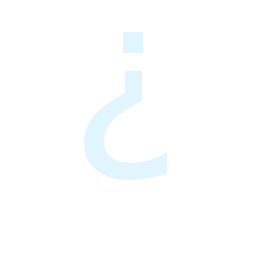
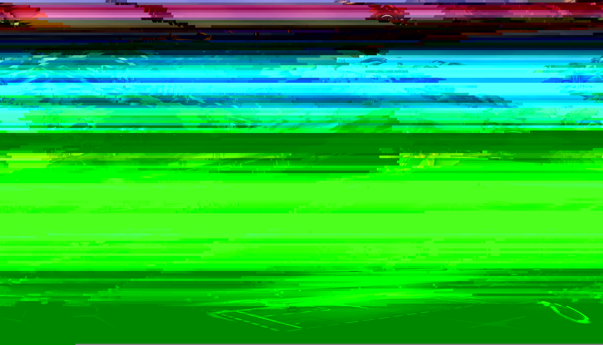

Play Overwatch Achievements
============================

On (DATE HERE), a new achievement was added to the [Play Overwatch](http://www.playoverwatch.com/)
page for logged in users.

Mystery Achievement
-------------------

Viewing the source of the HTML page right above the achievement, a comment can be seen:

    <!-- Vientos, nada mal. No obstante, me aburro. Intentemos algo nuevo en la misma dirección. uczihriwgsxorxwunaarawryqhbrsfmeqrjjmu 5552E494 78T3 4VM9 OPL6 IS8208O913KRlrx -->

Translating it, we see

> Damn, not bad. However, I'm getting bored. Let's try something new in the same direction.
> uczihriwgsxorxwunaarawryqhbrsfmeqrjjmu 5552E494 78T3 4VM9 OPL6 IS8208O913KRlrx

A [Vigenère cipher](https://en.wikipedia.org/wiki/Vigen%C3%A8re_cipher) was used to encrypt this data,
and the key used was derived from the name of the heroes as they appear on the Compass discovered
from the Summer Games video (see The [Game Detectives Wiki](http://wiki.gamedetectives.net/index.php?title=Sombra_ARG#Source_Code_of_Achievements_on_Play_Overwatch)
for a more thorough explanation of the compass).

### Decrypting the code

    $ cat code.txt
    uczihriwgsxorxwunaarawryqhbrsfmeqrjjmu 5552E494 78T3 4VM9 OPL6 IS8208O913KRlrx

Using the passphrase `tracertorbjornwinstonsymmetradvamercybastiongenjimccree`
the data can be deciphered to the following:

    $ cat code.txt | ./vigenere-decode tracertorbjornwinstonsymmetradvamercybastiongenjimccree
    blzgdapiproaakamaihdnetmediascreenshot 5552F494 78U3 4WN9 PQM6 JT8208P913LSjpg

Adding slashes, dots, hyphens, etc. this output can be turned into an image URL.

https://blzgdapipro-a.akamaihd.net/media/screenshot/5552E494-78B3-4CE9-ACF6-EF8208F913CF.jpg

### Extracting the hidden data

The original image is a [Screenshot of Volskaya](assets/volskaya-screenshot-004.jpg) from
the Overwatch media page, much like the original Dorado data mosh.

Using the same `diff-mosh` tool, we can extract the data:

    $ ../tools/diff-mosh assets/volskaya-screenshot-004.jpg assets/5552E494-78B3-4CE9-ACF6-EF8208F913CF.jpg
    1549 differences
    Original Diff: Parece que te gustan estos jueguitos... por que no jugamos uno de verdad?
                               :PB@Bk:                                                ,jB@@B@B@B@BBL.                                         7G@B@B@BMMMMMB@B@B@Nr                                  :kB@B@@@MMOMOMOMOMMMM@B@B@B1,                          :5@B@B@B@BBMMOMOMOMOMOMOMM@@@B@B@BBu.                   70@@@B@B@B@BXBBOMOMOMOMOMOMMBMPB@B@B@B@B@Nr              G@@@BJ iB@B@@  OBMOMOMOMOMOMOM@2  B@B@B. EB@B@S            @@BM@GJBU.  iSuB@OMOMOMOMOMOMM@OU1:  .kBLM@M@B@            B@MMB@B       7@BBMMOMOMOMOMOBB@:       B@BMM@B            @@@B@B         7@@@MMOMOMOMM@B@:         @@B@B@            @@OLB.          BNB@MMOMOMM@BEB          rBjM@B            @@  @           M  OBOMOMM@q  M          .@  @@            @@OvB           B:u@MMOMOMMBJiB          .BvM@B            @B@B@J         0@B@MMOMOMOMB@B@u         q@@@B@            B@MBB@v       G@@BMMMMMMMMMMMBB@5       F@BMM@B            @BBM@BPNi   LMEB@OMMMM@B@MMOMM@BZM7   rEqB@MBB@            B@@@BM  B@B@B  qBMOMB@B@B@BMOMBL  B@B@B  @B@B@M             J@@@@PB@B@B@B7G@OMBB.   ,@MMM@qLB@B@@@BqB@BBv                 iGB@,i0@M@B@MMO@E  :  M@OMM@@@B@Pii@@N:                       .   B@M@B@MMM@B@B@B@MMM@@@M@B                                  @B@B.i@MBB@B@B@@BM@::B@B@                                  B@@@ .B@B.:@B@ :B@B  @B@O                                    :0 r@B@  B@@ .@B@: P:                                          vMB :@B@ :BO7                                                  ,B@B                           
    Moshed Diff: !!!!!!!!!!!!!!!!!!!!!!!!!!!!!!!!!!!!!!!!!!!!!!!!!!!!!!!!!!!!!!!!!!!!!!!!!!!!!!!!!!!!!!!!!!!!!!!!!!!!!!!!!!!!!!!!!!!!!!!!!!!!!!!!!!!!!!!!!!!!!!!!!!!!!!!!!!!!!!!!!!!!!!!!!!!!!!!!!!!!!!!!!!!!!!!!!!!!!!!!!!!!!!!!!!!!!!!!!!!!!!!!!!!!!!!!!!!!!!!!!!!!!!!!!!!!!!!!!!!!!!!!!!!!!!!!!!!!!!!!!!!!!!!!!!!!!!!!!!!!!!!!!!!!!!!!!!!!!!!!!!!!!!!!!!!!!!!!!!!!!!!!!!!!!!!!!!!!!!!!!!!!!!!!!!!!!!!!!!!!!!!!!!!!!!!!!!!!!!!!!!!!!!!!!!!!!!!!!!!!!!!!!!!!!!!!!!!!!!!!!!!!!!!!!!!!!!!!!!!!!!!!!!!!!!!!!!!!!!!!!!!!!!!!!!!!!!!!!!!!!!!!!!!!!!!!!!!!!!!!!!!!!!!!!!!!!!!!!!!!!!!!!!!!!!!!!!!!!!!!!!!!!!!!!!!!!!!!!!!!!!!!!!!!!!!!!!!!!!!!!!!!!!!!!!!!!!!!!!!!!!!!!!!!!!!!!!!!!!!!!!!!!!!!!!!!!!!!!!!!!!!!!!!!!!!!!!!!!!!!!!!!!!!!!!!!!!!!!!!!!!!!!!!!!!!!!!!!!!!!!!!!!!!!!!!!!!!!!!!!!!!!!!!!!!!!!!!!!!!!!!!!!!!!!!!!!!!!!!!!!!!!!!!!!!!!!!!!!!!!!!!!!!!!!!!!!!!!!!!!!!!!!!!!!!!!!!!!!!!!!!!!!!!!!!!!!!!!!!!!!!!!!!!!!!!!!!!!!!!!!!!!!!!!!!!!!!!!!!!!!!!!!!!!!!!!!!!!!!!!!!!!!!!!!!!!!!!!!!!!!!!!!!!!!!!!!!!!!!!!!!!!!!!!!!!!!!!!!!!!!!!!!!!!!!!!!!!!!!!!!!!!!!!!!!!!!!!!!!!!!!!!!!!!!!!!!!!!!!!!!!!!!!!!!!!!!!!!!!!!!!!!!!!!!!!!!!!!!!!!!!!!!!!!!!!!!!!!!!!!!!!!!!!!!!!!!!!!!!!!!!!!!!!!!!!!!!!!!!!!!!!!!!!!!!!!!!!!!!!!!!!!!!!!!!!!!!!!!!!!!!!!!!!!!!!!!!!!!!!!!!!!!!!!!!!!!!!!!!!!!!!!!!!!!!!!!!!!!!!!!!!!!!!!!!!!!!!!!!!!!!!!!!!!!!!!!!!!!!!!!!!!!!!!!!!!!!!!!!!!!!!!!!!!!!!!!!!!!!!!!!!!!!!!!!!!!!!!!!!!!!!!!!!!!!!!!!!!!!!!!!!!!!!!!!!!!!!!!!!!!!!!!!!!!!!!!!!!!!!!!!!!!!!!!!!!!!!!!!!!!!!!!!!!!!!!!!!!!!!!!!!!!!!!!!!!!!!!!!!!!!!!!!!!!!!!!!!!!!!!!!!!!!!!!!!!!!!!!!!!!!!!!!!!!!!!!!!!!!!!!!!!!!!!!!!!!!!!!!!!!!!!!!!!!

Interesting points to note

1. The replaced characters in the mosh are `!` - same as Dorado
2. There is a newline character after the Spanish sentence, but nowhere else in the data

---

> Parece que te gustan estos jueguitos... por que no jugamos uno de verdad?

Translated becomes

> It seems you like these little games... Why don't we play a real one?

### The skull

The lines in the "Original Diff" that have a lot of strings like "MOMOM"
appears to be ascii art, but the newlines are missing.  Brute forcing it,
we can see that if a newline is added every *59th* character, a skull emerges.

    $ ../tools/diff-mosh assets/Volskaya-screenshot-004.jpg assets/5552E494-78B3-4CE9-ACF6-EF8208F913CF.jpg \
        | grep MOMOM | fold -59
                               :PB@Bk:                         
                           ,jB@@B@B@B@BBL.                     
                        7G@B@B@BMMMMMB@B@B@Nr                  
                    :kB@B@@@MMOMOMOMOMMMM@B@B@B1,              
                :5@B@B@B@BBMMOMOMOMOMOMOMM@@@B@B@BBu.          
             70@@@B@B@B@BXBBOMOMOMOMOMOMMBMPB@B@B@B@B@Nr       
           G@@@BJ iB@B@@  OBMOMOMOMOMOMOM@2  B@B@B. EB@B@S     
           @@BM@GJBU.  iSuB@OMOMOMOMOMOMM@OU1:  .kBLM@M@B@     
           B@MMB@B       7@BBMMOMOMOMOMOBB@:       B@BMM@B     
           @@@B@B         7@@@MMOMOMOMM@B@:         @@B@B@     
           @@OLB.          BNB@MMOMOMM@BEB          rBjM@B     
           @@  @           M  OBOMOMM@q  M          .@  @@     
           @@OvB           B:u@MMOMOMMBJiB          .BvM@B     
           @B@B@J         0@B@MMOMOMOMB@B@u         q@@@B@     
           B@MBB@v       G@@BMMMMMMMMMMMBB@5       F@BMM@B     
           @BBM@BPNi   LMEB@OMMMM@B@MMOMM@BZM7   rEqB@MBB@     
           B@@@BM  B@B@B  qBMOMB@B@B@BMOMBL  B@B@B  @B@B@M     
            J@@@@PB@B@B@B7G@OMBB.   ,@MMM@qLB@B@@@BqB@BBv      
               iGB@,i0@M@B@MMO@E  :  M@OMM@@@B@Pii@@N:         
                  .   B@M@B@MMM@B@B@B@MMM@@@M@B                
                      @B@B.i@MBB@B@B@@BM@::B@B@                
                      B@@@ .B@B.:@B@ :B@B  @B@O                
                        :0 r@B@  B@@ .@B@: P:                  
                            vMB :@B@ :BO7                      
                                ,B@B        

All skull analysis can be seen in this gist so far:

https://gist.github.com/bahamas10/852c4dbdfeab92691f8f03eb98cf88f1

Not sure where to go with this...

Results
-------

- 59 is a magic number for newlines in the skull

References
----------

- http://wiki.gamedetectives.net/index.php?title=Sombra_ARG#Source_Code_of_Achievements_on_Play_Overwatch
- http://wiki.gamedetectives.net/index.php?title=Sombra_ARG#New_Datamoshed_Photo
